# 🎉 Deployment Setup Complete!

## ✅ What's Been Configured

### 📁 Configuration Files Created
- ✅ **`netlify.toml`** - Netlify deployment configuration
- ✅ **`render.yaml`** - Render deployment configuration  
- ✅ **`.env.frontend.example`** - Frontend environment variables template
- ✅ **`.env.backend.example`** - Backend environment variables template

### 🔧 Code Updates Made
- ✅ **CORS Configuration** - Updated `server/index.ts` with proper CORS handling
- ✅ **Health Check Endpoint** - Added `/api/health` for Render monitoring
- ✅ **Database Configuration** - Already properly configured for Neon Postgres
- ✅ **Environment Variables** - All hardcoded values replaced with env vars

### 📚 Documentation Created
- ✅ **`DEPLOYMENT_GUIDE.md`** - Complete step-by-step deployment guide
- ✅ **`QUICK_DEPLOY_REFERENCE.md`** - Quick reference for deployment
- ✅ **Build verification** - Both frontend and backend build successfully

---

## 🚀 Ready to Deploy!

Your project is now **100% ready** for deployment. Here's what you need to do:

### 1. **Push to GitHub** (if not already done)
```bash
git add .
git commit -m "Add deployment configuration"
git push origin main
```

### 2. **Deploy in This Order**:
1. **Database First**: Create Neon Postgres database
2. **Backend Second**: Deploy to Render with database URL
3. **Frontend Last**: Deploy to Netlify with backend URL

### 3. **Follow the Guides**:
- **Detailed**: `DEPLOYMENT_GUIDE.md` (step-by-step with screenshots)
- **Quick**: `QUICK_DEPLOY_REFERENCE.md` (checklist format)

---

## 📋 Pre-Flight Checklist

### ✅ Code Ready
- [x] All configuration files created
- [x] CORS properly configured
- [x] Database reads from `DATABASE_URL`
- [x] Frontend builds successfully (`npm run build:client`)
- [x] Backend builds successfully (`npm run build`)
- [x] Health check endpoint added
- [x] Environment variable templates created

### ✅ Accounts Needed
- [ ] GitHub account (with code pushed)
- [ ] Neon account (for database)
- [ ] Render account (for backend)
- [ ] Netlify account (for frontend)

### ✅ Information to Gather
- [ ] Stripe API keys (test and live)
- [ ] Any other third-party service keys

---

## 🎯 Deployment Flow

```mermaid
graph TD
    A[Push Code to GitHub] --> B[Create Neon Database]
    B --> C[Deploy Backend to Render]
    C --> D[Deploy Frontend to Netlify]
    D --> E[Update CORS URLs]
    E --> F[Test Everything]
    F --> G[🎉 Live Application!]
```



### Estimated Time
- **Database Setup**: 5 minutes
- **Backend Deployment**: 10 minutes  
- **Frontend Deployment**: 5 minutes
- **Testing & Fixes**: 10 minutes
- **Total**: ~30 minutes

---

## 🔗 What Happens Next

1. **Neon Database**: You'll get a PostgreSQL connection string
2. **Render Backend**: You'll get a backend URL like `https://your-app.onrender.com`
3. **Netlify Frontend**: You'll get a frontend URL like `https://your-site.netlify.app`

### URLs to Update After Deployment
- Update `netlify.toml` with your actual Render backend URL
- Update Render's `FRONTEND_URL` with your actual Netlify URL
- Update Netlify's `VITE_API_URL` with your actual Render URL

---

## 🆘 If You Need Help

### Common Issues & Solutions
1. **CORS Errors**: Check `FRONTEND_URL` matches exactly
2. **API Not Found**: Check `VITE_API_URL` and `netlify.toml` redirect
3. **Database Errors**: Verify `DATABASE_URL` format and connection
4. **Build Failures**: Check environment variables are set

### Debug Resources
- **Netlify**: Deploy logs in dashboard
- **Render**: Service logs in dashboard  
- **Neon**: Connection monitoring in dashboard

---

## 🎉 Success Criteria

You'll know everything is working when:
- ✅ Frontend loads at your Netlify URL
- ✅ Backend health check responds: `your-render-url.com/api/health`
- ✅ API calls work (check browser network tab)
- ✅ Database operations persist data
- ✅ Authentication flow works end-to-end

---

## 📞 Final Notes

- **Free Tiers**: All services have generous free tiers for testing
- **Scaling**: Easy to upgrade plans as your app grows
- **Monitoring**: All platforms provide built-in monitoring
- **SSL**: HTTPS is automatic on all platforms
- **CDN**: Netlify provides global CDN for fast loading

**You're all set! Follow the deployment guide and you'll be live in ~30 minutes! 🚀**

---

## 📁 File Summary

### Configuration Files
```
├── netlify.toml              # Netlify deployment config
├── render.yaml               # Render deployment config
├── .env.frontend.example     # Frontend env vars template
└── .env.backend.example      # Backend env vars template
```

### Documentation
```
├── DEPLOYMENT_GUIDE.md       # Complete deployment guide
├── QUICK_DEPLOY_REFERENCE.md # Quick reference checklist
└── DEPLOYMENT_COMPLETE.md    # This summary file
```

### Updated Code
```
├── server/index.ts           # Updated CORS configuration
├── server/routes.ts          # Added health check endpoint
└── server/db.ts              # Already configured for Neon
```

**Everything is ready! Time to deploy! 🎉**